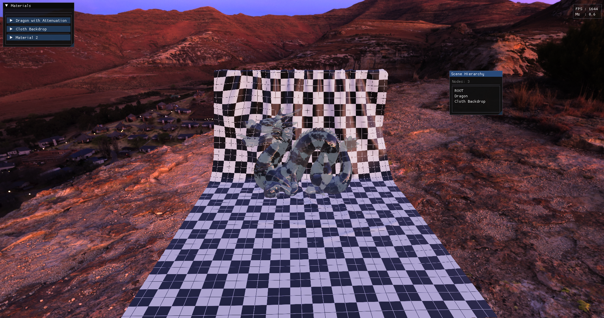
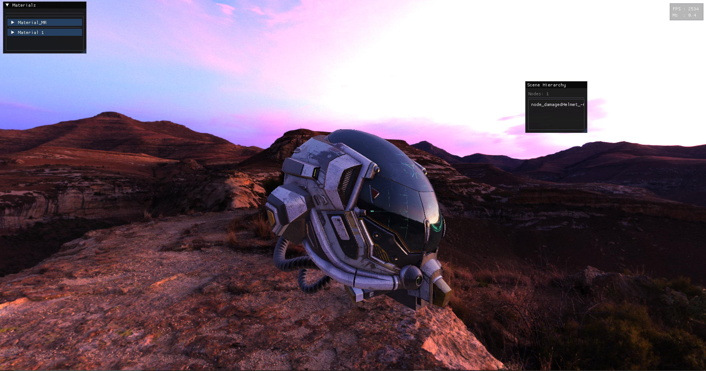
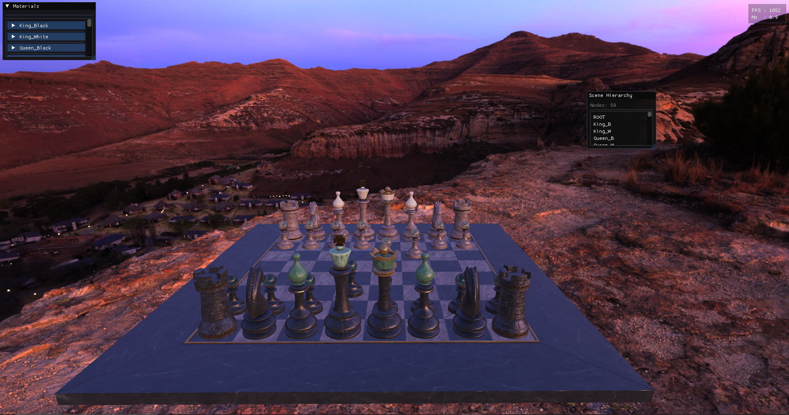
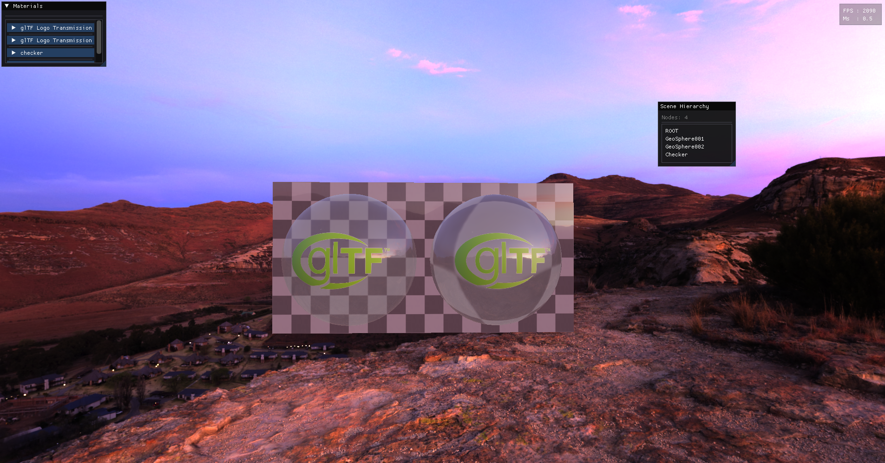
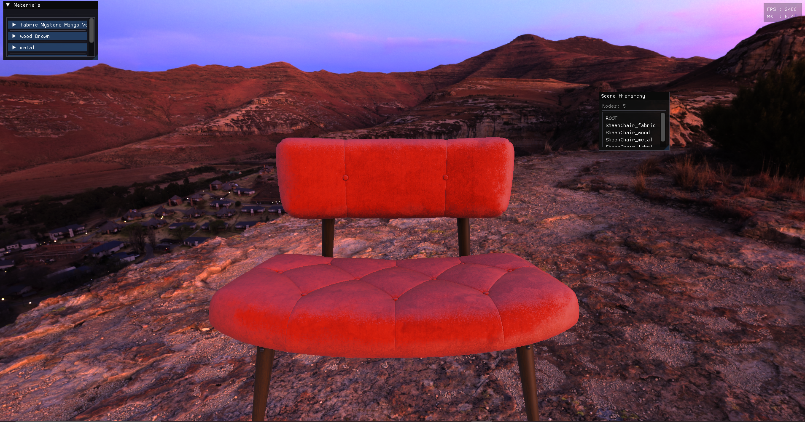

# Vulkan PBR Renderer

A work-in-progress of my Vulkan rendering engine



## Features
 Physically Based Rendering (PBR), glTF 2.0 support, Image-Based Lighting (IBL),  real-time upscaling via NVIDIA DLSS.

## Dependencies 
Vulkan SDK, GLFW, GLM, Assimp, ImGui, KTX-Software, MeshOptimizer, Volk, SPIRV-Headers/Tools

## Build Instructions

### 1. Prerequisites
Vulkan SDK, NVIDIA DLSS SDK

### 2. Download DLSS SDK
This project requires the proprietary NVIDIA NGX SDK to build the DLSS features.
1.  git clone the SDK from [github.com/NVIDIA/DLSS](https://github.com/NVIDIA/DLSS).
3.  **IMPORTANT:** You must place the SDK in the root of the project or open `CMakeLists.txt` and update the `DLSS_ROOT` variable to point to your local extraction path.

### 3. Build with CMake
1. **VERY IMORTANT:** if you're reading this it means that the path for the assets and shaders are still hardcoded in the code so you might need to change that

```bash

git clone https://github.com/roastedbread1/PBR.git
cd PBR
cmake --build . 
```
Some Screenshots



